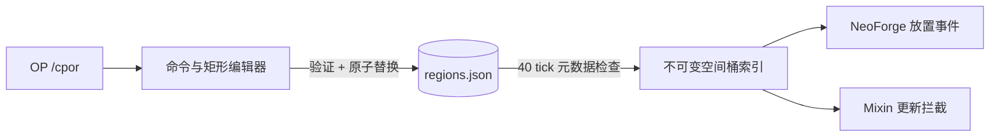

# 构件视图

| 模块 | 接口与职责 |
|---|---|
| `CporCommand` | 权限等级 2 的命令树；解析当前维度和区块坐标 |
| `RegionConfigEditor` | 矩形并集添加、矩形差集移除、规范化持久化 |
| `FrozenRegionManager` | 严格配置验证、原子快照安装、空间桶命中查询 |
| NeoForge/Mixin 适配器 | 在放置、邻居通知和目标形状更新接缝查询索引 |
| `regions.json` | 可审计的矩形配置；不按每个区块展开 |

命令写入在服务器线程的冷路径执行并受 8192 矩形上限约束。游戏热路径只读取发布后的不可变快照。
