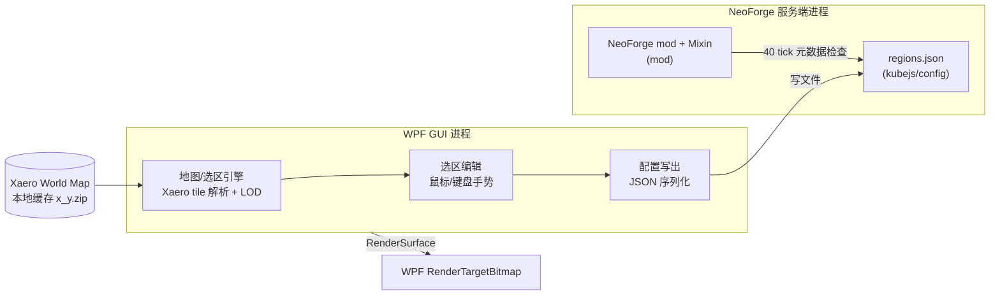

# §5 构件视图 L1（Building Blocks）

系统拆分为两大「机内构件」+ 一个「数据契约」。只画 L1 白盒。

## 构件职责

| 构件 | 职责 | 关键接口/依赖 |
|---|---|---|
| **NeoForge mod**（`mod/`） | 防放置；拦截普通邻居通知和目标侧形状更新；维护不可变空间桶索引；每 40 server ticks 检查配置元数据 | NeoForge `BlockEvent.EntityPlaceEvent` / Mixin |
| **regions.json**（`config-schema/`） | 保护区域唯一契约；GUI 写、mod 读 | JSON Schema `regions.schema.json` |
| **地图/选区引擎**（WPF） | 解析 Xaero `region.xaero` 图块、多级 LOD 渲染底图、区块网格叠加 | 直接读文件（只读） |
| **选区编辑**（WPF） | 手势交互：拖拽平移/滚轮缩放/Ctrl框选/右键取消，WASD 平移 + `-`/`=` 缩放 | 事件路由到引擎 |
| **配置写出**（WPF） | 把选区序列化为合法 `regions.json` | 读 `regions.schema.json` 校验 |

## 数据流（主次两条）

1. **地图流（只读单向）**：`Xaero tiles` → GUI 引擎逐级加载 → 渲染窗口。**不改写 Xaero 数据**。
2. **配置流（写回）**：GUI 编辑选区 → 校验 → 写 `regions.json` → mod 检测并刷新不可变索引 → 拦截生效。
